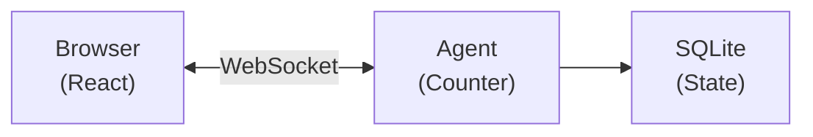

import {
	TypeScriptExample,
	WranglerConfig,
	PackageManagers,
	LinkCard,
} from "~/components";

Build AI agents that persist, think, and act. Agents run on Cloudflare's global network, maintain state across requests, and connect to clients in real-time via WebSockets.

**What you will build:** A counter agent with persistent state that syncs to a React frontend in real-time.

**Time:** ~10 minutes

## Create a new project

<PackageManagers
	type="create"
	pkg="cloudflare@latest"
	args={"-- --template cloudflare/agents-starter"}
/>

Then install dependencies and start the dev server:

```sh
cd my-agent
npm install
npm run dev
```

This creates a project with:

- `src/server.ts` — Your agent code
- `src/client.tsx` — React frontend
- `wrangler.jsonc` — Cloudflare configuration

Open [http://localhost:5173](http://localhost:5173) to see your agent in action.

## Your first agent

Build a simple counter agent from scratch. Replace `src/server.ts`:

<TypeScriptExample>

```ts title="src/server.ts"
import { Agent, routeAgentRequest, callable } from "agents";

// Define the state shape
type CounterState = {
	count: number;
};

// Create the agent
export class Counter extends Agent<Env, CounterState> {
	// Initial state for new instances
	initialState: CounterState = { count: 0 };

	// Methods marked with @callable can be called from the client
	@callable()
	increment() {
		this.setState({ count: this.state.count + 1 });
		return this.state.count;
	}

	@callable()
	decrement() {
		this.setState({ count: this.state.count - 1 });
		return this.state.count;
	}

	@callable()
	reset() {
		this.setState({ count: 0 });
	}
}

// Route requests to agents
export default {
	async fetch(request: Request, env: Env, ctx: ExecutionContext) {
		return (
			(await routeAgentRequest(request, env)) ??
			new Response("Not found", { status: 404 })
		);
	},
};
```

</TypeScriptExample>

Update `wrangler.jsonc` to register the agent:

<WranglerConfig>

```jsonc
{
	"name": "my-agent",
	"main": "src/server.ts",
	"compatibility_date": "2025-01-01",
	"compatibility_flags": ["nodejs_compat"],
	"durable_objects": {
		"bindings": [
			{
				"name": "Counter",
				"class_name": "Counter",
			},
		],
	},
	"migrations": [
		{
			"tag": "v1",
			"new_sqlite_classes": ["Counter"],
		},
	],
}
```

</WranglerConfig>

## Connect from React

Replace `src/client.tsx`:

```tsx title="src/client.tsx"
import { useState } from "react";
import { useAgent } from "agents/react";
import type { Counter } from "./server";

// Match your agent's state type
type CounterState = {
	count: number;
};

export default function App() {
	const [count, setCount] = useState(0);

	// Connect to the Counter agent
	const agent = useAgent<Counter, CounterState>({
		agent: "Counter",
		onStateUpdate: (state) => setCount(state.count),
	});

	return (
		<div style={{ padding: "2rem", fontFamily: "system-ui" }}>
			<h1>Counter Agent</h1>
			<p style={{ fontSize: "3rem" }}>{count}</p>
			<div style={{ display: "flex", gap: "1rem" }}>
				<button onClick={() => agent.stub.decrement()}>-</button>
				<button onClick={() => agent.stub.reset()}>Reset</button>
				<button onClick={() => agent.stub.increment()}>+</button>
			</div>
		</div>
	);
}
```

Key points:

- `useAgent` connects to your agent via WebSocket
- `onStateUpdate` fires whenever the agent's state changes
- `agent.stub.methodName()` calls methods marked with `@callable()` on your agent

## What just happened?

When you clicked the button:

1. **Client** called `agent.stub.increment()` over WebSocket
2. **Agent** ran `increment()`, updated state with `setState()`
3. **State** persisted to SQLite automatically
4. **Broadcast** sent to all connected clients
5. **React** updated via `onStateUpdate`



### Key concepts

| Concept              | What it means                                                                               |
| -------------------- | ------------------------------------------------------------------------------------------- |
| **Agent instance**   | Each unique name gets its own agent. `Counter:user-123` is separate from `Counter:user-456` |
| **Persistent state** | State survives restarts, deploys, and hibernation. It is stored in SQLite                   |
| **Real-time sync**   | All clients connected to the same agent receive state updates instantly                     |
| **Hibernation**      | When no clients are connected, the agent hibernates (no cost). It wakes on the next request |

## Connect from vanilla JavaScript

If you are not using React:

<TypeScriptExample>

```ts
import { AgentClient } from "agents/client";

const agent = new AgentClient({
	agent: "Counter",
	name: "my-counter", // optional, defaults to "default"
	onStateUpdate: (state) => {
		console.log("New count:", state.count);
	},
});

// Call methods
await agent.call("increment");
await agent.call("reset");
```

</TypeScriptExample>

## Deploy to Cloudflare

```sh
npm run deploy
```

Your agent is now live on Cloudflare's global network, running close to your users.

## Troubleshooting

### "Agent not found" or 404 errors

Make sure:

1. Agent class is exported from your server file
2. `wrangler.jsonc` has the binding and migration
3. Agent name in client matches the class name (case-insensitive)

### State not syncing

Check that:

1. You are calling `this.setState()`, not mutating `this.state` directly
2. The `onStateUpdate` callback is wired up in your client
3. WebSocket connection is established (check browser dev tools)

### "Method X is not callable" errors

Make sure your methods are decorated with `@callable()`:

<TypeScriptExample>

```ts
import { Agent, callable } from "agents";

export class MyAgent extends Agent {
	@callable()
	increment() {
		// ...
	}
}
```

</TypeScriptExample>

### Type errors with `agent.stub`

Add the agent and state type parameters:

<TypeScriptExample>

```ts
import { useAgent } from "agents/react";
import type { Counter } from "./server";

type CounterState = { count: number };

// Pass the agent and state types to useAgent
const agent = useAgent<Counter, CounterState>({
	agent: "Counter",
	onStateUpdate: (state) => setCount(state.count),
});

// Now agent.stub is fully typed
agent.stub.increment();
```

</TypeScriptExample>

## Next steps

Now that you have a working agent, explore these topics:

### Common patterns

| Learn how to             | Refer to                                                     |
| ------------------------ | ------------------------------------------------------------ |
| Add AI/LLM capabilities  | [Using AI models](/agents/api-reference/using-ai-models/)    |
| Expose tools via MCP     | [MCP servers](/agents/model-context-protocol/mcp-agent-api/) |
| Run background tasks     | [Schedule tasks](/agents/api-reference/schedule-tasks/)      |
| Handle emails            | [Email routing](/agents/api-reference/email/)                |
| Use Cloudflare Workflows | [Run Workflows](/agents/api-reference/run-workflows/)        |

### Explore more

<LinkCard
	title="State management"
	href="/agents/api-reference/store-and-sync-state/"
	description="Deep dive into setState(), initialState, and onStateUpdate()."
/>

<LinkCard
	title="Client SDK"
	href="/agents/api-reference/client-sdk/"
	description="Full useAgent and AgentClient API reference."
/>

<LinkCard
	title="Callable methods"
	href="/agents/api-reference/callable-methods/"
	description="Expose methods to clients with @callable()."
/>

<LinkCard
	title="Schedule tasks"
	href="/agents/api-reference/schedule-tasks/"
	description="Run tasks on a delay, schedule, or cron."
/>