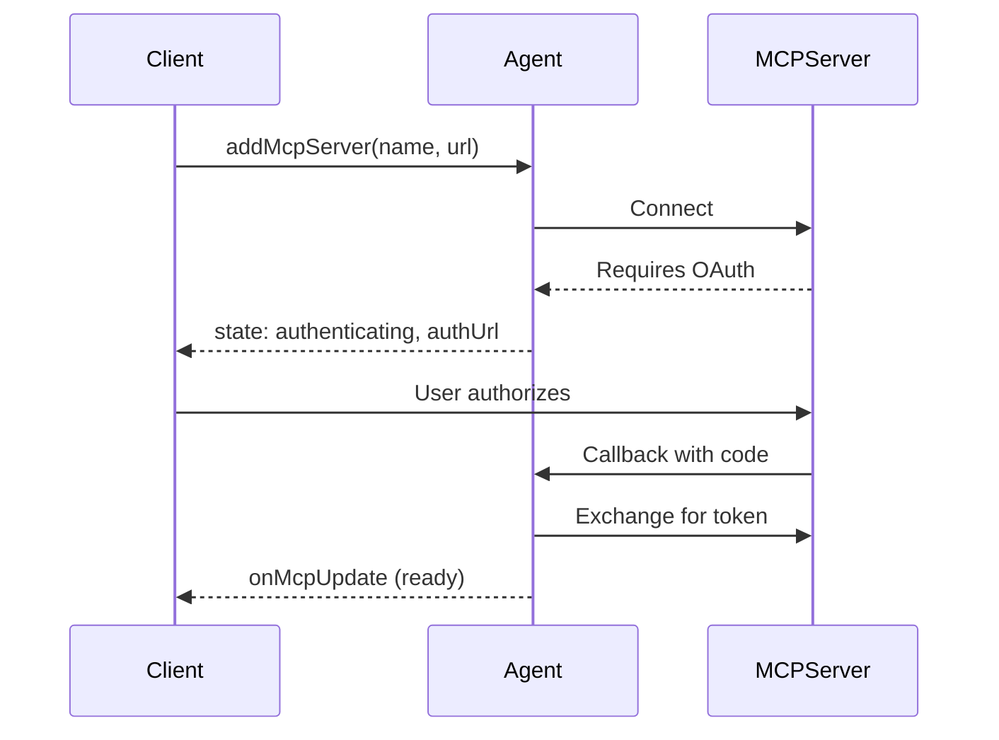

import { Render, TypeScriptExample, LinkCard } from "~/components";

Connect your agent to external MCP (Model Context Protocol) servers to use their tools, resources, and prompts. This enables your agent to interact with GitHub, Slack, databases, and other services through a standardized protocol.

## Overview

The MCP client capability lets your agent:

- **Connect to external MCP servers** - GitHub, Slack, databases, AI services
- **Use their tools** - Call functions exposed by MCP servers
- **Access resources** - Read data from MCP servers
- **Use prompts** - Leverage pre-built prompt templates

:::note

This page covers connecting to MCP servers as a client. To create your own MCP server, refer to [Creating MCP servers](/agents/model-context-protocol/mcp-agent-api/).

:::

## Quick start

<TypeScriptExample>

```ts
import { Agent } from "agents";

export class MyAgent extends Agent {
	async onRequest(request: Request) {
		// Add an MCP server
		const result = await this.addMcpServer(
			"github",
			"https://mcp.github.com/mcp",
		);

		if (result.state === "authenticating") {
			// Server requires OAuth - redirect user to authorize
			return Response.redirect(result.authUrl);
		}

		// Server is ready - tools are now available
		const state = this.getMcpServers();
		console.log(`Connected! ${state.tools.length} tools available`);

		return new Response("MCP server connected");
	}
}
```

</TypeScriptExample>

Connections persist in the agent's [SQL storage](/agents/api-reference/store-and-sync-state/), and when an agent connects to an MCP server, all tools from that server become available automatically.

## Adding MCP servers

Use `addMcpServer()` to connect to an MCP server:

<TypeScriptExample>

```ts
// Simple connection
await this.addMcpServer("notion", "https://mcp.notion.so/mcp");

// With explicit callback host
await this.addMcpServer("github", "https://mcp.github.com/mcp", {
	callbackHost: "https://my-worker.workers.dev",
});
```

</TypeScriptExample>

### Transport options

MCP supports multiple transport types:

<TypeScriptExample>

```ts
await this.addMcpServer("server", "https://mcp.example.com/mcp", {
	transport: {
		type: "streamable-http",
	},
});
```

</TypeScriptExample>

| Transport         | Description                                         |
| ----------------- | --------------------------------------------------- |
| `streamable-http` | HTTP with streaming - recommended default           |
| `sse`             | Server-Sent Events - legacy/compatibility transport |
| `auto`            | Auto-detect based on server response                |

### Custom headers

For servers behind authentication (like Cloudflare Access) or using bearer tokens:

<TypeScriptExample>

```ts
await this.addMcpServer("internal", "https://internal-mcp.example.com/mcp", {
	transport: {
		headers: {
			Authorization: "Bearer my-token",
			"CF-Access-Client-Id": "...",
			"CF-Access-Client-Secret": "...",
		},
	},
});
```

</TypeScriptExample>

### Return value

`addMcpServer()` returns the connection state:

- `ready` - Server connected and tools discovered
- `authenticating` - Server requires OAuth; redirect user to `authUrl`

## OAuth authentication

Many MCP servers require OAuth authentication. The agent handles the OAuth flow automatically.

### How it works



### Handling OAuth in your agent

<TypeScriptExample>

```ts
class MyAgent extends Agent {
	async onRequest(request: Request) {
		const result = await this.addMcpServer(
			"github",
			"https://mcp.github.com/mcp",
		);

		if (result.state === "authenticating") {
			// Option 1: Redirect the user
			return Response.redirect(result.authUrl);

			// Option 2: Return the URL for client-side redirect
			return Response.json({
				status: "needs_auth",
				authUrl: result.authUrl,
			});
		}

		return Response.json({ status: "connected", id: result.id });
	}
}
```

</TypeScriptExample>

### OAuth callback

The callback URL is automatically constructed:

```txt
https://{host}/{agentsPrefix}/{agent-name}/{instance-name}/callback
```

For example: `https://my-worker.workers.dev/agents/my-agent/default/callback`

OAuth tokens are securely stored in SQLite, and persist across agent restarts.

### Protecting instance names in OAuth callbacks

When using `sendIdentityOnConnect: false` to hide sensitive instance names (like session IDs or user IDs), the default OAuth callback URL would expose the instance name. To prevent this security issue, you must provide a custom `callbackPath`.

<TypeScriptExample>

```ts
import { Agent, routeAgentRequest, getAgentByName } from "agents";

export class SecureAgent extends Agent {
	static options = { sendIdentityOnConnect: false };

	async onRequest(request: Request) {
		// callbackPath is required when sendIdentityOnConnect is false
		const result = await this.addMcpServer(
			"github",
			"https://mcp.github.com/mcp",
			{
				callbackPath: "mcp-oauth-callback", // Custom path without instance name
			},
		);

		if (result.state === "authenticating") {
			return Response.redirect(result.authUrl);
		}

		return new Response("Connected!");
	}
}

// Route the custom callback path to the agent
export default {
	async fetch(request: Request, env: Env) {
		const url = new URL(request.url);

		// Route custom MCP OAuth callback to agent instance
		if (url.pathname.startsWith("/mcp-oauth-callback")) {
			// Implement this to extract the instance name from your session/auth mechanism
			const instanceName = await getInstanceNameFromSession(request);

			const agent = await getAgentByName(env.SecureAgent, instanceName);
			return agent.fetch(request);
		}

		// Standard agent routing
		return (
			(await routeAgentRequest(request, env)) ??
			new Response("Not found", { status: 404 })
		);
	},
};
```

</TypeScriptExample>

:::note[How callback matching works]

OAuth callbacks are matched by the `state` query parameter (format: `{serverId}:{stateValue}`), not by URL path. This means your custom `callbackPath` can be any path you choose, as long as requests to that path are routed to the correct agent instance.

:::

### Custom OAuth callback handling

Configure how OAuth completion is handled. By default, successful authentication redirects to your application origin, while failed authentication displays an HTML error page.

<TypeScriptExample>

```ts
export class MyAgent extends Agent {
	onStart() {
		this.mcp.configureOAuthCallback({
			// Redirect after successful auth
			successRedirect: "https://myapp.com/success",

			// Redirect on error with error message in query string
			errorRedirect: "https://myapp.com/error",

			// Or use a custom handler
			customHandler: () => {
				// Close popup window after auth completes
				return new Response("<script>window.close();</script>", {
					headers: { "content-type": "text/html" },
				});
			},
		});
	}
}
```

</TypeScriptExample>

## Using MCP capabilities

Once connected, access the server's capabilities:

### Getting available tools

<TypeScriptExample>

```ts
const state = this.getMcpServers();

// All tools from all connected servers
for (const tool of state.tools) {
	console.log(`Tool: ${tool.name}`);
	console.log(`  From server: ${tool.serverId}`);
	console.log(`  Description: ${tool.description}`);
}
```

</TypeScriptExample>

### Resources and prompts

<TypeScriptExample>

```ts
const state = this.getMcpServers();

// Available resources
for (const resource of state.resources) {
	console.log(`Resource: ${resource.name} (${resource.uri})`);
}

// Available prompts
for (const prompt of state.prompts) {
	console.log(`Prompt: ${prompt.name}`);
}
```

</TypeScriptExample>

### Server status

<TypeScriptExample>

```ts
const state = this.getMcpServers();

for (const [id, server] of Object.entries(state.servers)) {
	console.log(`${server.name}: ${server.state}`);
	// state: "ready" | "authenticating" | "connecting" | "connected" | "discovering" | "failed"
}
```

</TypeScriptExample>

### Integration with AI SDK

To use MCP tools with the Vercel AI SDK, use `this.mcp.getAITools()` which converts MCP tools to AI SDK format:

<TypeScriptExample>

```ts
import { generateText } from "ai";
import { openai } from "@ai-sdk/openai";

export class MyAgent extends Agent {
	async onRequest(request: Request) {
		const response = await generateText({
			model: openai("gpt-4"),
			prompt: "What's the weather in San Francisco?",
			tools: this.mcp.getAITools(), // Converts MCP tools to AI SDK format
		});

		return new Response(response.text);
	}
}
```

</TypeScriptExample>

:::note

`getMcpServers().tools` returns raw MCP `Tool` objects for inspection. Use `this.mcp.getAITools()` when passing tools to the AI SDK.

:::

## Managing servers

### Removing a server

<TypeScriptExample>

```ts
await this.removeMcpServer(serverId);
```

</TypeScriptExample>

This disconnects from the server and removes it from storage.

### Persistence

MCP servers persist across agent restarts:

- Server configuration stored in SQLite
- OAuth tokens stored securely
- Connections restored automatically when agent wakes

### Listing all servers

<TypeScriptExample>

```ts
const state = this.getMcpServers();

for (const [id, server] of Object.entries(state.servers)) {
	console.log(`${id}: ${server.name} (${server.server_url})`);
}
```

</TypeScriptExample>

## Client-side integration

Connected clients receive real-time MCP updates via WebSocket:

<TypeScriptExample>

```tsx
import { useAgent } from "agents/react";
import { useState } from "react";

function Dashboard() {
	const [tools, setTools] = useState([]);
	const [servers, setServers] = useState({});

	const agent = useAgent({
		agent: "MyAgent",
		onMcpUpdate: (mcpState) => {
			setTools(mcpState.tools);
			setServers(mcpState.servers);
		},
	});

	return (
		<div>
			<h2>Connected Servers</h2>
			{Object.entries(servers).map(([id, server]) => (
				<div key={id}>
					{server.name}: {server.state}
				</div>
			))}

			<h2>Available Tools ({tools.length})</h2>
			{tools.map((tool) => (
				<div key={`${tool.serverId}-${tool.name}`}>{tool.name}</div>
			))}
		</div>
	);
}
```

</TypeScriptExample>

## API reference

### `addMcpServer()`

Add a connection to an MCP server and make its tools available to your agent.

```ts
async addMcpServer(
  serverName: string,
  url: string,
  options?: {
    callbackHost?: string;
    callbackPath?: string;
    agentsPrefix?: string;
    client?: ClientOptions;
    transport?: {
      headers?: HeadersInit;
      type?: "sse" | "streamable-http" | "auto";
    };
  }
): Promise<
  | { id: string; state: "authenticating"; authUrl: string }
  | { id: string; state: "ready" }
>
```

#### Parameters

- `serverName` (string, required) — Display name for the MCP server
- `url` (string, required) — URL of the MCP server endpoint
- `options` (object, optional) — Connection configuration:
  - `callbackHost` — Host for OAuth callback URL. If omitted, automatically derived from the incoming request
  - `callbackPath` — Custom callback URL path that bypasses the default `/agents/{class}/{name}/callback` construction. **Required when `sendIdentityOnConnect` is `false`** to prevent leaking the instance name. When set, the callback URL becomes `{callbackHost}/{callbackPath}`. You must route this path to the agent instance via `getAgentByName`
  - `agentsPrefix` — URL prefix for OAuth callback path. Default: `"agents"`. Ignored when `callbackPath` is provided
  - `client` — MCP client configuration options (passed to `@modelcontextprotocol/sdk` Client constructor). By default, includes `CfWorkerJsonSchemaValidator` for validating tool parameters against JSON schemas
  - `transport` — Transport layer configuration:
    - `headers` — Custom HTTP headers for authentication
    - `type` — Transport type: `"streamable-http"` (default), `"sse"`, or `"auto"`

#### Returns

A Promise that resolves to a discriminated union based on connection state:

- When `state` is `"authenticating"`:
  - `id` (string) — Unique identifier for this server connection
  - `state` (`"authenticating"`) — Server is waiting for OAuth authorization
  - `authUrl` (string) — OAuth authorization URL for user authentication

- When `state` is `"ready"`:
  - `id` (string) — Unique identifier for this server connection
  - `state` (`"ready"`) — Server is fully connected and operational

### `removeMcpServer()`

Disconnect from an MCP server and clean up its resources.

```ts
async removeMcpServer(id: string): Promise<void>
```

#### Parameters

- `id` (string, required) — Server connection ID returned from `addMcpServer()`

### `getMcpServers()`

Get the current state of all MCP server connections.

```ts
getMcpServers(): MCPServersState
```

#### Returns

```ts
type MCPServersState = {
	servers: Record<
		string,
		{
			name: string;
			server_url: string;
			auth_url: string | null;
			state:
				| "authenticating"
				| "connecting"
				| "connected"
				| "discovering"
				| "ready"
				| "failed";
			capabilities: ServerCapabilities | null;
			instructions: string | null;
			error: string | null;
		}
	>;
	tools: Array<Tool & { serverId: string }>;
	prompts: Array<Prompt & { serverId: string }>;
	resources: Array<Resource & { serverId: string }>;
	resourceTemplates: Array<ResourceTemplate & { serverId: string }>;
};
```

The `state` field indicates the connection lifecycle:

- `authenticating` — Waiting for OAuth authorization to complete
- `connecting` — Establishing transport connection
- `connected` — Transport connection established
- `discovering` — Discovering server capabilities (tools, resources, prompts)
- `ready` — Fully connected and operational
- `failed` — Connection failed (see `error` field for details)

The `error` field contains an error message when `state` is `"failed"`. Error messages from external OAuth providers are automatically escaped to prevent XSS attacks, making them safe to display directly in your UI.

### `configureOAuthCallback()`

Configure OAuth callback behavior for MCP servers requiring authentication. This method allows you to customize what happens after a user completes OAuth authorization.

```ts
this.mcp.configureOAuthCallback(options: {
  successRedirect?: string;
  errorRedirect?: string;
  customHandler?: () => Response | Promise<Response>;
}): void
```

#### Parameters

- `options` (object, required) — OAuth callback configuration:
  - `successRedirect` (string, optional) — URL to redirect to after successful authentication
  - `errorRedirect` (string, optional) — URL to redirect to after failed authentication. Error message is appended as `?error=<message>` query parameter
  - `customHandler` (function, optional) — Custom handler for complete control over the callback response. Must return a Response

#### Default behavior

When no configuration is provided:

- **Success**: Redirects to your application origin
- **Failure**: Displays an HTML error page with the error message

If OAuth fails, the connection state becomes `"failed"` and the error message is stored in the `server.error` field for display in your UI.

#### Usage

Configure in `onStart()` before any OAuth flows begin:

<TypeScriptExample>

```ts
export class MyAgent extends Agent {
	onStart() {
		// Option 1: Simple redirects
		this.mcp.configureOAuthCallback({
			successRedirect: "/dashboard",
			errorRedirect: "/auth-error",
		});

		// Option 2: Custom handler (e.g., for popup windows)
		this.mcp.configureOAuthCallback({
			customHandler: () => {
				return new Response("<script>window.close();</script>", {
					headers: { "content-type": "text/html" },
				});
			},
		});
	}
}
```

</TypeScriptExample>

## Advanced: MCPClientManager

For fine-grained control, use `this.mcp` directly:

### Step-by-step connection

<TypeScriptExample>

```ts
// 1. Register the server
await this.mcp.registerServer(id, {
	url: "https://mcp.example.com/mcp",
	name: "My Server",
	callbackUrl: "https://my-worker.workers.dev/agents/my-agent/default/callback",
	transport: { type: "auto" },
});

// 2. Connect
const connectResult = await this.mcp.connectToServer(id);

if (connectResult.state === "failed") {
	console.error("Connection failed:", connectResult.error);
	return;
}

if (connectResult.state === "authenticating") {
	// Handle OAuth...
	return;
}

// 3. Discover capabilities
const discoverResult = await this.mcp.discoverIfConnected(id);

if (!discoverResult?.success) {
	console.error("Discovery failed:", discoverResult?.error);
}
```

</TypeScriptExample>

### Event subscription

<TypeScriptExample>

```ts
// Listen for state changes
this.mcp.onServerStateChanged(() => {
	console.log("MCP server state changed");
	this.broadcastMcpServers(); // Notify connected clients
});
```

</TypeScriptExample>

### Lifecycle methods

#### `this.mcp.registerServer()`

Register a server without immediately connecting.

```ts
async registerServer(
  id: string,
  options: {
    url: string;
    name: string;
    callbackUrl: string;
    clientOptions?: ClientOptions;
    transportOptions?: TransportOptions;
  }
): Promise<string>
```

#### `this.mcp.connectToServer()`

Establish a connection to a previously registered server.

```ts
async connectToServer(id: string): Promise<MCPConnectionResult>

type MCPConnectionResult =
  | { state: "failed"; error: string }
  | { state: "authenticating"; authUrl: string }
  | { state: "connected" }
```

#### `this.mcp.discoverIfConnected()`

Check server capabilities if a connection is active.

```ts
async discoverIfConnected(
  serverId: string,
  options?: { timeoutMs?: number }
): Promise<MCPDiscoverResult | undefined>

type MCPDiscoverResult = {
  success: boolean;
  state: MCPConnectionState;
  error?: string;
}
```

#### `this.mcp.closeConnection()`

Close the connection to a specific server while keeping it registered.

```ts
async closeConnection(id: string): Promise<void>
```

#### `this.mcp.closeAllConnections()`

Close all active server connections while preserving registrations.

```ts
async closeAllConnections(): Promise<void>
```

#### `this.mcp.getAITools()`

Get all discovered MCP tools in a format compatible with the AI SDK.

```ts
getAITools(): ToolSet
```

Tools are automatically namespaced by server ID to prevent conflicts when multiple MCP servers expose tools with the same name.

## Error handling

Use error detection utilities to handle connection errors:

<TypeScriptExample>

```ts
import { isUnauthorized, isTransportNotImplemented } from "agents/mcp";

export class MyAgent extends Agent {
	async onRequest(request: Request) {
		try {
			await this.addMcpServer("Server", "https://mcp.example.com/mcp");
		} catch (error) {
			if (isUnauthorized(error)) {
				return new Response("Authentication required", { status: 401 });
			} else if (isTransportNotImplemented(error)) {
				return new Response("Transport not supported", { status: 400 });
			}
			throw error;
		}
	}
}
```

</TypeScriptExample>

## Next steps

<LinkCard
	title="Creating MCP servers"
	href="/agents/model-context-protocol/mcp-agent-api/"
	description="Build your own MCP server."
/>

<LinkCard
	title="Client SDK"
	href="/agents/api-reference/client-sdk/"
	description="Connect from browsers with onMcpUpdate."
/>

<LinkCard
	title="Store and sync state"
	href="/agents/api-reference/store-and-sync-state/"
	description="Learn about agent persistence."
/>
