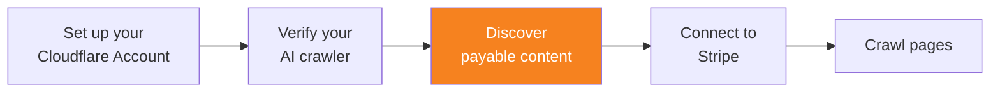

import { Steps } from "~/components";



The Pay Per Crawl Discovery API allows verified AI crawlers to discover which domains offer paid content access. This enables your crawler to proactively identify sites participating in Pay Per Crawl before making crawl requests.

## Prerequisites

Before using the Pay Per Crawl Discovery API, you must:

- [Set up your Cloudflare account](/ai-crawl-control/features/pay-per-crawl/use-pay-per-crawl-as-ai-owner/set-up-cloudflare-account/)
- [Verify your AI crawler](/ai-crawl-control/features/pay-per-crawl/use-pay-per-crawl-as-ai-owner/verify-ai-crawler/)

## Authenticate with Web Bot Auth

All requests to the Discovery API must be authenticated using HTTP message signatures with Web Bot Auth headers. This ensures that only verified crawlers can access the list of participating domains.

<Steps>

1. Generate your Web Bot Auth signature following the steps in [Sign your requests](/bots/reference/bot-verification/web-bot-auth/#4-after-verification-sign-your-requests).

2. Construct the required headers as described in [Construct the required headers](/bots/reference/bot-verification/web-bot-auth/#43-construct-the-required-headers):
   - `Signature`: The cryptographic signature of the request
   - `Signature-Input`: The signature metadata and parameters
   - `Signature-Agent`: Information about the signing agent

</Steps>

## Discover participating domains

### API endpoint

```txt
GET https://crawlers-api.ai-audit.cfdata.org/charged_zones
```

### Request parameters

- `cursor` (optional): Cursor returned from a previous call for pagination
- `limit` (optional): Number of results to return per request

### Request headers

Include the HTTP message signature headers generated using Web Bot Auth:

```txt
Signature: <your-signature>
Signature-Input: <signature-metadata>
Signature-Agent: <agent-information>
```

### Example request

```sh
curl -X GET "https://crawlers-api.ai-audit.cfdata.org/charged_zones?limit=50" \
  -H "Signature: <your-signature>" \
  -H "Signature-Input: <signature-metadata>" \
  -H "Signature-Agent: <agent-information>"
```

### Response format

The API returns a list of zones (domains) that have Pay Per Crawl enabled and are accepting payments from your crawler.

```json
{
	"result": {
		"zones": [
			{
				"domain": "example.com"
			},
			{
				"domain": "news-site.com"
			}
		]
	},
	"success": true,
	"errors": [],
	"messages": []
}
```

### Response fields

- `result.zones`: Array of zone objects containing domains with Pay Per Crawl enabled
- `result.zones[].domain`: The domain name offering Pay Per Crawl content
- `success`: Boolean indicating whether the request was successful
- `errors`: Array of error messages (empty if successful)
- `messages`: Array of informational messages

## Use discovery data

The Discovery API returns domains where site owners have specifically configured your crawler to be charged for content access. If a domain does not appear in the response, the site owner has not enabled Pay Per Crawl charging for your crawler. Site owners may also block or allow your crawler through WAF rules or set directives in their robots.txt file, which you should check and respect.

Cache discovery results locally and refresh periodically to stay up-to-date with domains joining or leaving Pay Per Crawl.

## Additional resources

- [Crawl pages](/ai-crawl-control/features/pay-per-crawl/use-pay-per-crawl-as-ai-owner/crawl-pages/)
