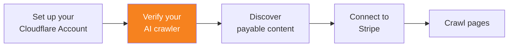

import { Steps, DashButton } from "~/components";



Once you have connected your Stripe account, set up your AI crawler as a [verified bot](/bots/concepts/bot/verified-bots/).

## Content access restriction

When an AI crawler tries to access content protected by pay per crawl, it receives a HTTP status code 402. This indicates payment is required. The HTTP header of the response includes the cost of the content.

For example, the response header may look like below:

```
HTTP/2 402
date: Fri, 06 Jun 2025 08:42:38 GMT
content-type: text/plain; charset=utf-8
crawler-price: USD 0.01
server: cloudflare
```

To access this content, you must verify your AI crawler.

## 1. Follow Web Bot Auth protocol

Ensure your AI crawler identifies itself with the required headers for Web Bot Auth.

Follow the steps found in [Web Both Auth](/bots/reference/bot-verification/web-bot-auth/).

## 2. Follow verified bot policy

Ensure your AI crawler follows Cloudflare's [verified bots policy](/bots/concepts/bot/verified-bots/policy/).

## 3. Submit verification request

Submit a form to add your AI crawler to Cloudflare's list of verified bots.

{/* prettier-ignore */}
<Steps>
1. In the Cloudflare dashboard, go to **Manage Account** > **Settings**.

	<DashButton url="/?to=/:account/configurations" />

2. Go to the **Bot Submission Form** tab.

3. Fill out the form with the following required information:
   - **Select bot type**: Choose either **Verified Bot** or **Signed Agent**.
   - **Verification Method**: Select **Request Signature**.
   - **User-Agents header values**: Provide the User-Agent string(s) your bot uses.
   - **User-Agents Match Pattern**: Provide substring patterns that match your User-Agent (for example, `GoogleBot | GoogleScraper`).

4. Select **Submit**.
</Steps>
