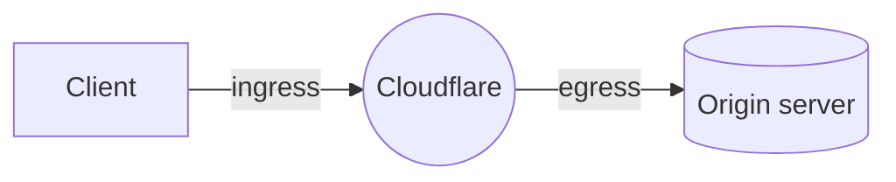

import { DirectoryListing } from "~/components";

In IP address management, service bindings are mappings that control whether traffic destined for a given IP address is routed to [Magic Transit](/magic-transit/), the CDN pipeline [^1], or the Spectrum pipeline [^2].

Service binding operations are currently only available via API. You can find all endpoints and their specifications in the [Cloudflare API documentation](/api/resources/addressing/subresources/prefixes/subresources/service_bindings/). For detailed guidance, refer to the sections and tutorials linked below.

:::note
Service bindings take four to six hours to propagate across Cloudflare's global network after being created or deleted. Services for the IP addresses in scope are likely disrupted during this window.
:::

## Scope

Customers using BYOIP with Magic Transit, [CDN services](/cache/), or [Spectrum](/spectrum/) can leverage the [service binding API endpoints](/api/resources/addressing/subresources/prefixes/subresources/service_bindings/) to selectively route traffic through the CDN [^1] or Spectrum [^2] pipelines on a per-IP address basis. This means:

- You can upgrade individual IPs within a Magic Transit prefix to either a CDN IP or a Spectrum IP. For example, if you have a Magic Transit prefix `203.0.113.0/24`, you can upgrade `203.0.113.1` to CDN and `203.0.113.2` to Spectrum.
- You can upgrade individual IPs within a CDN prefix to a Spectrum IP. For example, if you have a CDN prefix `203.0.113.0/24`, you can upgrade `203.0.113.1` to Spectrum.
- You can upgrade individual IPs within a Spectrum prefix to a CDN IP. For example, if you have a Spectrum prefix `203.0.113.0/24`, you can upgrade `203.0.113.1` to CDN.

Refer to [Magic Transit with CDN](/byoip/service-bindings/magic-transit-with-cdn/) or [CDN and Spectrum](/byoip/service-bindings/cdn-and-spectrum/) for detailed guidance.

:::caution
Magic Transit customers must ensure that their contract includes CDN and/or Spectrum according to their needs.
:::

### CDN (Cache)

When a service binding of type `CDN` is applied, once the change has propagated across Cloudflare's global network (four to six hours), any HTTP requests are directed into the CDN pipeline for Layer 7 processing.

### Spectrum

When a service binding of type `Spectrum` is applied, once the change has propagated across Cloudflare's global network (four to six hours), any TCP/UDP/HTTP requests are directed into the Spectrum pipeline for Layer 4 or Layer 7 processing.

### Magic Transit

:::note
Magic Transit can only be used as default binding, spanning across your entire prefix. You can then add CDN or Spectrum for smaller subnets but not the other way around.
:::

The entire BYOIP prefix is primarily announced for Magic Transit, providing layer 3 DDoS protection and acceleration. Traffic not explicitly bound to CDN will flow through Magic Transit.

Also, traffic egressing to an IP in the prefix will always go to Magic Transit, even if there is an overlapping binding for CDN or Spectrum. This allows customers who want to use the same IP as ingress IP and as origin IP to do so.

When adding a service binding for a given IP address, it must be either a CDN service binding or a Spectrum service binding. It is not possible (or necessary) to bind both services.

## Tutorials

<DirectoryListing />

[^1]: Layer 7 HTTP-based
[^2]: Layer 4 or Layer 7 HTTP with custom ports