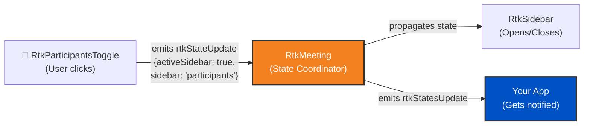

import { Tabs, TabItem, Render } from "~/components";

<Render file="realtimekit/common/default-meeting-examples" product="realtime" />

:::note[Prerequisites]
This page builds upon the [Initialize SDK](/realtime/realtimekit/core/) and [Render Default Meeting UI](/realtime/realtimekit/ui-kit/) guides. Make sure you've read those first.

The code examples on this page assume you've already imported the necessary packages and initialized the SDK. We won't repeat those setup steps here for brevity.
:::

<Tabs syncKey="realtimeKitFrameworkTabs">
<TabItem label="Web Components">

## How UI Kit Components Communicate

The UI Kit components are able to understand and synchronize with each other because they are nested under the `rtk-meeting` component. The `rtk-meeting` component acts as the central coordinator that ensures all components under it stay in sync when it comes to meeting state, participant updates, and other real-time changes.

Here's an example of how state synchronization works when opening the participants sidebar:


### State Flow

1. **Child components emit state updates**: When any UI component (like `rtk-button`, `rtk-participants`, `rtk-grid`) needs to update state, it emits a state update event
2. **rtk-meeting listens and coordinates**: The `rtk-meeting` component listens to all these state update events from its children
3. **State propagation**: `rtk-meeting` propagates the updated state to all other child components to keep them synchronized
4. **External notification**: `rtk-meeting` also emits `rtkStatesUpdate` event that your application can listen to for updating your custom UI or performing actions based on state changes

## Listening to State Updates

To build custom UI or perform actions based on meeting state changes, you need to listen to the `rtkStatesUpdate` event emitted by the `rtk-meeting` component. This event provides you with the current state of the meeting, including active speaker, participant list, recording status, and more.

:::note
Store the states in a state management solution (like React's `useState` or a plain JavaScript object) to alter your UI based on meeting state changes.
:::

For Web Components, you need to add an event listener to the `rtk-meeting` component to listen for `rtkStatesUpdate` events.

### Example Code

```html
<body>
	<rtk-meeting id="meeting-component"></rtk-meeting>
</body>
<script type="module">
	import RealtimeKitClient from "https://cdn.jsdelivr.net/npm/@cloudflare/realtimekit@latest/dist/index.es.js";

	const meeting = await RealtimeKitClient.init({
		authToken: "<participant_auth_token>",
	});

	// Add <rtk-meeting id="meeting-component" /> to your HTML, otherwise you will get error
	const meetingComponent = document.querySelector("#meeting-component");

	// Listen for state updates from rtk-meeting
	meetingComponent.addEventListener("rtkStatesUpdate", (event) => {
		console.log("RTK states updated:", event.detail);

		// Store states to update your custom UI
		const states = event.detail;

		// Example: Access various state properties
		console.log("Meeting state:", states.meeting); // 'idle', 'setup', 'joined', 'ended', 'waiting'
		console.log("Is sidebar active:", states.activeSidebar);
		console.log("Current sidebar section:", states.sidebar); // 'chat', 'participants', 'polls', etc.
		console.log("Is screen sharing:", states.activeScreenShare);

		// Update your custom UI based on states
		// For example: Show/hide elements based on meeting state
		if (states.meeting === "joined") {
			// Show meeting controls
		}
	});

	meetingComponent.showSetupScreen = true;
	meetingComponent.meeting = meeting;
</script>
```

### State Properties

The `rtkStatesUpdate` event provides detailed information about the UI Kit's internal state. Key properties include:

- **`meeting`**: Current meeting state - `'idle'`, `'setup'`, `'joined'`, `'ended'`, or `'waiting'`
- **`activeSidebar`**: Whether the sidebar is currently open (boolean)
- **`sidebar`**: Current sidebar section - `'chat'`, `'participants'`, `'polls'`, `'plugins'`, etc.
- **`activeScreenShare`**: Whether screen sharing UI is active (boolean)
- **`activeMoreMenu`**: Whether the more menu is open (boolean)
- **`activeSettings`**: Whether settings panel is open (boolean)
- **`viewType`**: Current video grid view type (string)
- **`prefs`**: User preferences object (e.g., `mirrorVideo`, `muteNotificationSounds`)
- **`roomLeftState`**: State when leaving the room
- **`activeOverlayModal`**: Active overlay modal configuration object
- **`activeConfirmationModal`**: Active confirmation modal configuration object
- **And many more UI state properties**

:::note
These are **UI Kit internal states** for managing the interface. For meeting data like participants, active speaker, or recording status, use the [Core SDK's meeting object](/realtime/realtimekit/core/meeting-object-explained/) directly.
:::

</TabItem>
<TabItem label="React">

## How UI Kit Components Communicate

The UI Kit components are able to understand and synchronize with each other because they are nested under the `RtkMeeting` component. The `RtkMeeting` component acts as the central coordinator that ensures all components under it stay in sync when it comes to meeting state, participant updates, and other real-time changes.

Here's an example of how state synchronization works when opening the participants sidebar:



### State Flow

1. **Child components emit state updates**: When any UI component (like `RtkButton`, `RtkParticipants`, `RtkGrid`) needs to update state, it emits a state update event
2. **RtkMeeting listens and coordinates**: The `RtkMeeting` component listens to all these state update events from its children
3. **State propagation**: `RtkMeeting` propagates the updated state to all other child components to keep them synchronized
4. **External notification**: `RtkMeeting` also emits `rtkStatesUpdate` event that your application can listen to for updating your custom UI or performing actions based on state changes

## Listening to State Updates

To build custom UI or perform actions based on meeting state changes, you need to listen to the `rtkStatesUpdate` event emitted by the `RtkMeeting` component. This event provides you with the current state of the meeting, including active speaker, participant list, recording status, and more.

:::note
Store the states in a state management solution (like React's `useState` or a plain JavaScript object) to alter your UI based on meeting state changes.
:::

For React, you can use the `onRtkStatesUpdate` prop on the `RtkMeeting` component to listen for state updates.

### Example Code

```jsx
import {
	RealtimeKitProvider,
	useRealtimeKitClient,
} from "@cloudflare/realtimekit-react";
import { RtkMeeting } from "@cloudflare/realtimekit-react-ui";
import { useEffect, useState } from "react";

function App() {
	const [meeting, initMeeting] = useRealtimeKitClient();
	const [authToken, setAuthToken] = useState("<participant_auth_token>");
	const [states, setStates] = useState({});

	useEffect(() => {
		if (authToken) {
			initMeeting({
				authToken: authToken,
			});
		}
	}, [authToken]);

	return (
		<RealtimeKitProvider value={meeting}>
			<RtkMeeting
				showSetupScreen={true}
				meeting={meeting}
				onRtkStatesUpdate={(e) => {
					// Update states when rtk-meeting emits state updates
					setStates(e.detail);

					// Example: Access various state properties
					console.log("Meeting state:", e.detail.meeting); // 'idle', 'setup', 'joined', 'ended', 'waiting'
					console.log("Is sidebar active:", e.detail.activeSidebar);
					console.log("Current sidebar section:", e.detail.sidebar);
					console.log("Is screen sharing:", e.detail.activeScreenShare);
				}}
			/>

			{/* Use states to build custom UI */}
			<div className="custom-ui">
				<p>Meeting State: {states.meeting}</p>
				<p>Sidebar Open: {states.activeSidebar ? "Yes" : "No"}</p>
			</div>
		</RealtimeKitProvider>
	);
}
```

### Alternative: Using Refs (Multiple Meetings)

If you're building an experience with multiple meetings on the same page or back-to-back meetings, using refs is recommended to avoid state conflicts between different meeting instances:

```jsx
import {
	RealtimeKitProvider,
	useRealtimeKitClient,
} from "@cloudflare/realtimekit-react";
import { RtkMeeting } from "@cloudflare/realtimekit-react-ui";
import { useEffect, useState, useRef } from "react";

function App() {
	const [meeting, initMeeting] = useRealtimeKitClient();
	const [authToken, setAuthToken] = useState("<participant_auth_token>");
	const [states, setStates] = useState({});
	const meetingRef = useRef(null);

	useEffect(() => {
		if (authToken) {
			initMeeting({
				authToken: authToken,
			});
		}
	}, [authToken]);

	useEffect(() => {
		if (!meetingRef.current) return;

		const handleStatesUpdate = (e) => {
			setStates(e.detail);
			console.log("Meeting state:", e.detail.meeting);
			console.log("Is sidebar active:", e.detail.activeSidebar);
		};

		// Add event listener via ref
		meetingRef.current.addEventListener("rtkStatesUpdate", handleStatesUpdate);

		// Cleanup listener when component unmounts or meeting changes
		return () => {
			meetingRef.current?.removeEventListener(
				"rtkStatesUpdate",
				handleStatesUpdate,
			);
		};
	}, [meetingRef.current]);

	return (
		<RealtimeKitProvider value={meeting}>
			<RtkMeeting ref={meetingRef} showSetupScreen={true} meeting={meeting} />

			{/* Use states to build custom UI */}
			<div className="custom-ui">
				<p>Meeting State: {states.meeting}</p>
				<p>Sidebar Open: {states.activeSidebar ? "Yes" : "No"}</p>
			</div>
		</RealtimeKitProvider>
	);
}
```

:::note
Using refs with event listeners provides better control and isolation when handling multiple `RtkMeeting` instances. This approach ensures that state updates from one meeting don't interfere with another, which is crucial for back-to-back meetings or multi-meeting interfaces.
:::

### State Properties

The `onRtkStatesUpdate` event provides detailed information about the UI Kit's internal state. Key properties include:

- **`meeting`**: Current meeting state - `'idle'`, `'setup'`, `'joined'`, `'ended'`, or `'waiting'`
- **`activeSidebar`**: Whether the sidebar is currently open (boolean)
- **`sidebar`**: Current sidebar section - `'chat'`, `'participants'`, `'polls'`, `'plugins'`, etc.
- **`activeScreenShare`**: Whether screen sharing UI is active (boolean)
- **`activeMoreMenu`**: Whether the more menu is open (boolean)
- **`activeSettings`**: Whether settings panel is open (boolean)
- **`viewType`**: Current video grid view type (string)
- **`prefs`**: User preferences object (e.g., `mirrorVideo`, `muteNotificationSounds`)
- **`roomLeftState`**: State when leaving the room
- **`activeOverlayModal`**: Active overlay modal configuration object
- **`activeConfirmationModal`**: Active confirmation modal configuration object
- **And many more UI state properties**

:::note
These are **UI Kit internal states** for managing the interface. For meeting data like participants, active speaker, or recording status, use the [Core SDK's meeting object](/realtime/realtimekit/core/meeting-object-explained/) directly.
:::

</TabItem>
</Tabs>

## Best Practices

- **Store states appropriately**: Use React's `useState` hook or a state management library (like Zustand or Redux) for React apps. For vanilla JavaScript, use a reactive state management solution or simple object storage.
- **Avoid excessive re-renders**: Only update your UI when necessary. In React, consider using `useMemo` or `useCallback` to optimize performance.
- **Access nested properties safely**: Always check if nested properties exist before accessing them (e.g., `states.sidebar`, `states.prefs?.mirrorVideo`).
- **Use states for conditional rendering**: Leverage the UI states to show/hide UI elements or respond to interface changes (e.g., showing custom indicators when `states.activeScreenShare` is true).
- **Understand the difference**: `rtkStatesUpdate` provides **UI Kit internal states** for interface management. For meeting data (participants, active speaker, recording status), use the Core SDK's `meeting` object and its events directly.
