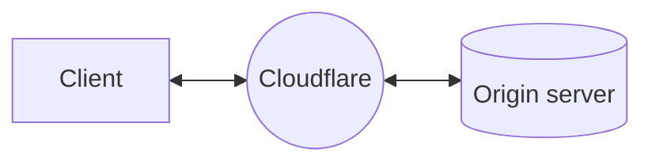
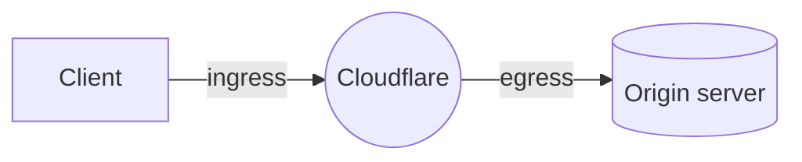

import { Render } from "~/components";

When you use Cloudflare [as a reverse proxy](/fundamentals/concepts/how-cloudflare-works/#how-cloudflare-works-as-a-reverse-proxy), [Cloudflare's global network](https://www.cloudflare.com/network/) sits between client requests and your origin servers.

Zooming into what happens as a request routes through Cloudflare, you can consider two parts of the process: ingress and egress.

Ingress refers to the data center where the client request lands on, based on Internet routing. From there on, the request will be processed according to your Cloudflare configurations and, if needed, a connection to the origin will be initiated via an egress data center.

Traditionally, Cloudflare maintains a very large pool of egress IPs that are used by all Cloudflare customers and are [publicly documented](https://www.cloudflare.com/ips/). With Dedicated CDN Egress IPs, Cloudflare connects to your origin using IPs that are reserved for you.

## BYOIP or Cloudflare-leased

Each dedicated CDN egress IP pool can consist of either IPs from a [BYOIP prefix](/byoip/) or Cloudflare-leased IPs. A single dedicated CDN egress IP pool cannot contain both BYOIPs and leased IPs.

<Render
  file="check-leased-ips"
	product="byoip"
	params={{
		product: "dedicated IPs for CDN egress"
	}}
/>

If you are using BYOIP, refer to [**IP addresses** > **BYOIP prefixes**](https://dash.cloudflare.com/?to=/:account/ip-addresses/ip-prefixes) instead.

## IPs allocation

Dedicated CDN Egress IPs support both IPv4 and IPv6 addresses.

IPv6 address ranges are deployed globally, meaning your dedicated IPv6 addresses can be used for connections from Cloudflare to your origin servers across all Cloudflare data centers.

:::note[China exception]
Dedicated CDN Egress IPs are currently **not** available in the [Cloudflare China Network](/china-network/).
:::

For IPv4 addresses, you should work with your account team to choose the locations where each IP should be deployed. Ideally, your dedicated IPv4 addresses should be placed near your origin servers and adjusted to the amount of traffic expected for each region.

Refer to [connection forwarding](/smart-shield/configuration/dedicated-egress-ips/how-it-works/connection-forwarding/) to understand how requests are processed when reaching different Cloudflare data centers.

### Connections to your origin

<Render file="concurrent-connections-explainer" product="smart-shield" />

Dedicated CDN Egress IPs also benefit from [connection reuse and coalescing](/smart-shield/concepts/connection-reuse/).

GraphQL Analytics API allows you to get visibility over [IPs utilization](/smart-shield/configuration/dedicated-egress-ips/ips-utilization/).

### Regional Services

If you are using [Regional Services](/data-localization/regional-services/), you should take this into consideration when allocating dedicated IPv4 addresses. Traffic will egress from the specified locations as long as you have Dedicated CDN Egress IPs provisioned in those locations.