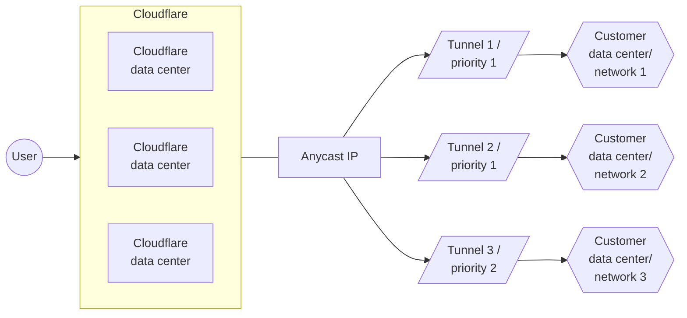

## Definition

Visualizations that depict a process, architecture, or some other form of technology. We recommend either using [SVG files](#svg-diagrams) or [Mermaid diagrams](#mermaid-diagrams).

## Used in

All content types

## Overview

Diagrams explain complex topics in a compelling way and help users visualize a specific solution, process, or interaction between products.

## SVG diagrams

Use SVG files instead of PNG or JPEG because SVG scales well when users want to zoom in. Use clear and straightforward `Alt text` with your SVG for use by screen readers.

We optimize SVG files with a [recurring script](https://github.com/cloudflare/cloudflare-docs/blob/production/scripts/optimize-svgs.ts) in our repo.

### Template

```md

```

### Example


```md

## Mermaid diagrams

Use Mermaid diagrams to illustrate product or process flows. If they work for your use case, Mermaid diagrams are preferable to other [diagrams](/style-guide/documentation-content-strategy/component-attributes/diagrams/) because they are more easily searchable and changeable.

Our Mermaid diagrams are based on [`rehype-mermaid`](https://github.com/remcohaszing/rehype-mermaid/) and [`mermaid`](https://www.npmjs.com/package/mermaid).

## Template



````

````

## Related components

- [Screenshots](/style-guide/documentation-content-strategy/component-attributes/screenshots/)
