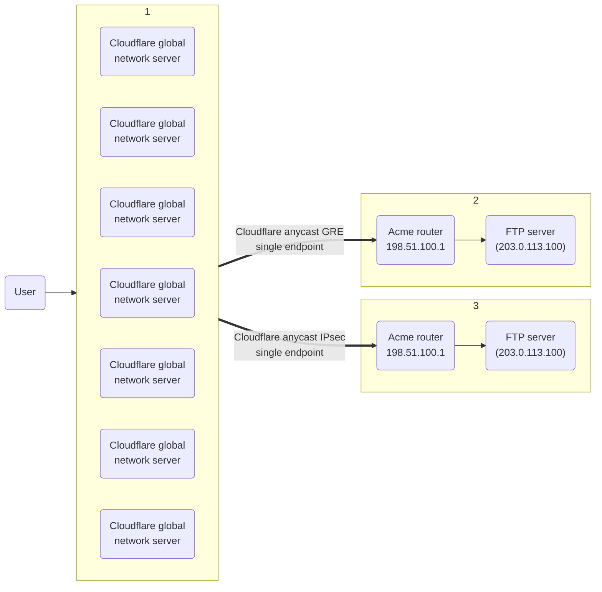

---
params:
  - magicWord?
  - productName
  - mssURL
  - productURL
  - tunnelEndpoints
---

import { AnchorHeading, GlossaryTooltip, Markdown, Details } from "~/components";

## Tunnels and encapsulation

{props.productName} uses <GlossaryTooltip term="GRE tunnel" link="https://www.cloudflare.com/learning/network-layer/what-is-gre-tunneling/">Generic Routing Encapsulation (GRE)</GlossaryTooltip> and <GlossaryTooltip term="IPsec tunnel" link="https://www.cloudflare.com/learning/network-layer/what-is-ipsec/">IPsec tunnels</GlossaryTooltip> to transmit packets from Cloudflare's global network to your origin network. Cloudflare sets up tunnel endpoints on global network servers inside your network namespace, and you set up tunnel endpoints on routers at your data center.

To accommodate additional header data introduced by encapsulation, you must adjust the <GlossaryTooltip term="maximum segment size (MSS)">maximum segment size (MSS)</GlossaryTooltip> to comply with the standard Internet routable maximum transmission unit (MTU), which is 1500 bytes.

For instructions, refer to <a href={props.mssURL}>Set maximum segment size</a>.

This diagram illustrates the flow of traffic with {props.productName}.

<pre class="mermaid">
{`sequenceDiagram
accTitle: Tunnels and encapsulation
accDescr: This diagram shows the flow of traffic with ${props.productName}.
participant A as Client machine
participant B as Cloudflare ${props.productName}
participant C as Origin router
A->>B: Payload   Protocol   IP header
Note left of A: Ingress   traffic
B->>C: Payload   Protocol   IP header   GRE   IP header
C->>A: IP header   Protocol   Payload
Note right of C: Egress   traffic`}
</pre>

 

:::note
By default, your Internet Service Provider (ISP) interface routes egress packets, not Cloudflare.
:::

## Anycast

{props.productName} uses <GlossaryTooltip term="anycast" link="https://www.cloudflare.com/learning/cdn/glossary/anycast-network/">anycast</GlossaryTooltip> IP addresses for Cloudflare's tunnel endpoints. In the anycast model, any server in any data center can receive traffic and must be capable of encapsulating and decapsulating packets for any tunnel.

This works with <GlossaryTooltip term="GRE tunnel">GRE</GlossaryTooltip> tunnels because the GRE protocol is stateless. Cloudflare processes each packet independently without requiring any negotiation or coordination between tunnel endpoints. Tunnel endpoints bind to IP addresses but not to specific devices. Any device that can strip off the outer headers and then route the inner packet can handle any GRE packet sent over the tunnel.

For <GlossaryTooltip term="IPsec tunnel">IPsec</GlossaryTooltip> tunnels, the customer's router negotiates the creation of an IPsec tunnel with Cloudflare using the <GlossaryTooltip term="Internet key exchange (IKE)">Internet Key Exchange (IKE)</GlossaryTooltip> protocol. Next, the Cloudflare server that handled that negotiation will propagate the details of that newly created IPsec tunnel (traffic selectors, keys, etc.) across Cloudflare's data centers. The result is that any Cloudflare server can then handle traffic for that IPsec tunnel, even though only one Cloudflare server actually negotiated the setup of that tunnel.

Cloudflare's anycast architecture provides a conduit to your tunnel for every server in every data center on Cloudflare's global network. The following image shows this architecture.

## IPsec tunnels

[IPsec](https://www.cloudflare.com/learning/network-layer/what-is-ipsec/) is a group of protocols that work together to set up encrypted connections between devices. It helps keep data you send over public networks secure. Organizations often use IPsec to set up Virtual Private Networks (VPNs), and it works by encrypting IP packets and authenticating the source where the packets come from.

For information on how to set up an IPsec tunnel, refer to <a href={props.tunnelEndpoints}>Configure tunnel endpoints</a>. To learn more about the configuration parameters {props.productName} uses to create an IPsec tunnel, keep reading.

### How IKEv2 establishes an IPsec tunnel

{props.productName} uses the following stages to establish an IPsec tunnel:

- **Initial Exchange** (`IKE_SA_INIT`): IKE peers negotiate parameters for the IKE Security Association (SA) and establish a shared secret for key derivation. After this exchange, the peers have a secure communication channel but they have not yet authenticated each other. If supported, the peers will also perform Network Address Translation (NAT) detection in this exchange.
- **Auth Exchange** (`IKE_AUTH`): Using the secure tunnel from the initial exchange, IKE peers mutually authenticate each other. After authentication, they establish the IKE security association (SA). Next, the peers negotiate and establish an IPsec tunnel, known as a Child SA.

:::note
The IKE SA and the Child SA are separate entities, each with their own parameters. The Child SA is the actual IPsec tunnel where user traffic flows (that is, the dataplane). The IKE SA sets up and manages the Child SA.
:::

In summary, IKEv2 creates an IKE SA that uses certain cryptographic transforms. It then uses that IKE SA to create a Child SA which itself uses certain cryptographic transforms. The following configuration section details which of these transforms {props.productName} currently supports for IKE SAs and Child SAs.

:::note
IKE is one of the protocols that makes up IPsec. Cloudflare only operates as an IKE responder.
:::

### Supported configuration parameters

Choose from the following configuration parameters that {props.productName} supports, based on what your appliance supports.

Documentation sometimes refers to IKE SA as Phase 1 as per IKEv1 language.

- **Encryption**
  - AES-GCM-16 with 128-bit or 256-bit key length
  - AES-CBC with 256-bit key length

- **Integrity** (sometimes referred to as Authentication)
  - SHA2-256

- **Diffie-Hellman group**:
  Cloudflare supports the following Diffie-Hellman (DH) groups.

  - DH group 20 (384-bit random ECP group)
  - DH group 14 (2048-bit MODP group)
  - DH group 5 (1536-bit MODP group)

	:::caution
	Cloudflare recommends that you use only one DH group when configuring your device, specifically **DH group 20**.
	:::

- **Pseudorandom function (PRF)**

	Do not confuse this with Perfect Forward Secrecy (PFS). You often cannot configure PRF.
  - SHA2-256
  - SHA2-384
  - SHA2-512

The Child SA. Documentation sometimes refers to this as Phase 2 as per IKEv1 language.

- **Encryption**:

  - AES-GCM-16 with 128-bit or 256-bit key length
  - AES-CBC with 128-bit or 256-bit key length

- **Integrity** (sometimes referred to as Authentication.)

  - SHA2-256
  - SHA-1

  :::note
  When using AES-GCM-16, you do not need an integrity algorithm because AES GCM includes integrity checking (since it is an Authenticated Encryption with Associated Data (AEAD) algorithm). Even when using an AEAD algorithm, however, some routers still require you to select an integrity algorithm.
  :::

- **Perfect Forward Secrecy (PFS) group**

	Documentation sometimes refers to this as Phase 2 Diffie-Hellman Group. Do not confuse this with PRF. Cloudflare supports the following Diffie-Hellman (DH) groups.

  - DH group 20 (384-bit random ECP group)
  - DH group 14 (2048-bit MODP group)
  - DH group 5 (1536-bit MODP group)

	:::caution
	Cloudflare recommends that you use only one DH group when configuring your device, specifically **DH group 20**.
	:::

- The IKE version must be IKEv2.
- The IKE authentication method must be Pre-Shared Key (PSK).
- If your router is behind Network Address Translation (NAT) and requires NAT traversal (NAT-T), then your router must initiate IKE communication on port `4500`. Most devices support configuring NAT-T to begin on port `4500` (exceptions include at least some versions of the Cisco ASA). Cloudflare does not support NAT-T for IKE sessions which begin on port `500` and then switch to port `4500`.
- (Uncommon) You must disable Extended Sequence Numbers (ESN).
- If your tunnels need replay protection, enable Dead Peer Detection (DPD) in your router and select the option that restarts your IKE session when a DPD timeout occurs. This "restart" option ensures that the connection can recover in the event that a Cloudflare server goes offline. If your router does not offer this setting, check the router documentation for its dead peer detection behavior.

- Disable <a href={props.productURL}>anti-replay protection</a>.
- **`NULL` encryption for IPsec:** Do not use this option unless necessary because it reduces security by leaving IPsec traffic unencrypted. You must explicitly opt in to use this option.

### Supported IKE ID formats

{props.productName} supports the following IKE ID types for IPsec:

- **Format**: `ipsec@<TUNNEL_ID>.<ACCOUNT_ID>.ipsec.cloudflare.com`
- **Example**: `ipsec@f5407d8db1a542b196c59f6d04ba8bd1.123456789.ipsec.cloudflare.com`

- **Format**: `<TUNNEL_ID>.<ACCOUNT_ID>.ipsec.cloudflare.com`
- **Example**: `f5407d8db1a542b196c59f6d04ba8bd1.123456789.ipsec.cloudflare.com`

- **Format**: `<ACCOUNT_ID>_<TUNNEL_ID>`
- **Example**: `123456789_f5407d8db1a542b196c59f6d04ba8bd1`

Additionally, Cloudflare supports the IKE ID type of `ID_IPV4_ADDR` if the following two conditions are met:

1. You set the IPsec tunnel's `customer_endpoint` value.
2. The combination of `cloudflare_endpoint` and `customer_endpoint` is unique among the customer's IPsec tunnels.

:::caution
Make sure each IPsec tunnel has a unique combination of a <a href={props.tunnelEndpoints}>Cloudflare endpoint and customer endpoint</a>. If this combination is not unique among your IPsec tunnels, you should use one of the custom IKE formats (`ID_RFC822_ADDR`, `ID_FQDN`, or `ID_KEY_ID`) to specify the tunnel ID and account ID. This helps Cloudflare link the IKE packet to the right IPsec tunnel for tasks like authentication.
:::

### Route-based vs. policy-based VPNs

Although Cloudflare supports both route-based and policy-based VPNs, we recommend route-based VPNs.

If route-based VPNs are not an option and you must use policy-based VPNs, be aware of the following limitations:

- Cloudflare only supports a single set of traffic selectors per Child SA.
- A policy must cover reply-style health checks — that is, they must match traffic selectors — otherwise, Cloudflare drops them, just like any other traffic from an IPsec tunnel that does not match a policy.
- A single IPsec tunnel can only contain around 100 Child SAs. Therefore, there is effectively a limit on the number of different policies per tunnel.

{ props.magicWord === "Magic Transit" && (
  <>
	<AnchorHeading title="Network Analytics" depth={2} />
	
Cloudflare's Network Analytics provides near real-time visibility into network and transport layer traffic patterns and Distributed Denial of Service (DDoS) attacks to help troubleshoot IP traffic issues. You can also use Network Analytics to view information about the traffic that leaves Cloudflare's global network by reviewing ingress and egress tunnel traffic over a specific amount of time.

	
For more information, refer to <a href="/magic-transit/analytics/">Analytics</a>.

  </>
  )
}
