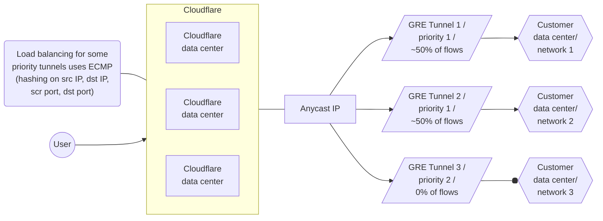
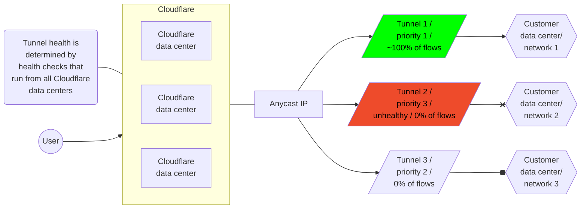
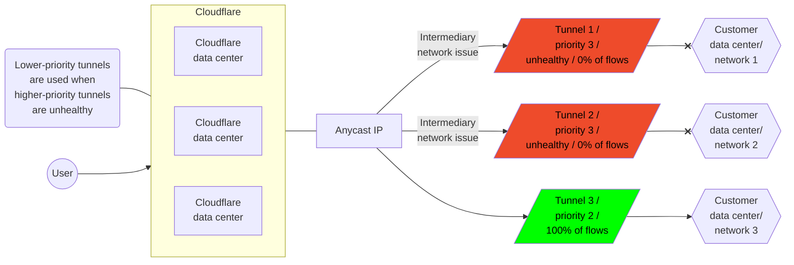

---
params:
  - magicWord
  - productName
  - virtualNetworkName
  - mFirewallName
  - mFirewallURL
  - warpClientURL
  - remoteBrowserURL
  - accessURL
  - gatewayURL
  - cfTunnelURL?
  - greIpsecReferenceURL
  - createStaticRoute
  - editStaticRoute
  - setupBgpPeering
  - legacyHCs
  - tunnelHCsPage
---

import { AnchorHeading, Aside, Markdown, Render } from "~/components";

## Magic routing table

The {props.virtualNetworkName} is a virtual network overlay, private to your account, that spans all Cloudflare data centers globally. This overlay network provides:

- Magic Transit delivery for [Denial of Service (DoS)](/ddos-protection/) and <a href={props.mFirewallURL}>{props.mFirewallName}</a> filtered Internet traffic, from the entry data center where the traffic ingressed, to your publicly addressed edge/border network.
- {props.productName} packet transport between Magic tunnels, interconnects, [Cloudflare Load Balancer](/load-balancing/), and [Zero Trust](/cloudflare-one/) connections such as <a href={props.warpClientURL}>WARP Client</a>, <a href={props.remoteBrowserURL}>Remote Browser Isolation</a>, <a href={props.accessURL}>Access</a>, and <a href={props.gatewayURL}>Gateway</a>.

The Magic routing table supports routing the {props.productName} traffic through anycast tunnels using <a href={props.greIpsecReferenceURL}>GRE and Internet Protocol Security (IPsec)</a> or [CNI with Dataplane v2](/network-interconnect/). You can add entries to the Magic routing table through static route configuration or through routes learned through BGP peering (beta).{ props.magicWord !== "Magic Transit" && (<> Traffic can also be routed automatically according to tracked flow state.</>)}


### Allowed IP ranges

The following IPv4 address ranges are allowed in the Magic Routing table:

{ props.magicWord === "Magic Transit" && (
  <>
		<Markdown
    text={`
		- [BYOIP](/byoip/) public address space which you have onboarded to Cloudflare Magic Transit.
		- Cloudflare [leased IPs](/magic-transit/cloudflare-ips/) assigned to your account.
			`}
				inline={false}
  />
  </>
  )
}

{ props.magicWord !== "Magic Transit" && (
  <>
		<Render
			file="routing/magic-wan-allowed-ip-ranges"
			product="networking-services"
			params={{
				productName: props.productName,
				cfTunnelURL: props.cfTunnelURL
			}}
		/>
  </>
  )
}

### Route prioritization

{props.productName} steers traffic along tunnel routes based on route entry priorities.

- Lower values have greater priority.
- When the priority values for prefix entries match, Cloudflare uses [equal-cost multi-path (ECMP)](#equal-cost-multi-path-routing) packet forwarding to route traffic. You can apply an optional weight value to static routes to [modify ECMP tunnel distribution](#set-priority-and-weights-for-static-routes).
- <Render file="longest-prefix-match" product="networking-services/reference" />
- When BGP and static routes have the same prefix and priority, Cloudflare enforces priority by preferring static routes over BGP routes. This ensures that manually configured static routes take precedence unless you explicitly deprioritize them.

### Set priority and weights for static routes

The priority value for static routes is directly configured as part of the route object in the Cloudflare <a href={props.createStaticRoute}>dashboard or through the API</a>. For example:


| Prefix | NextHop | Priority |
| ----- | ----- | ----- |
| `10.10.10.100/24` | `TUNNEL_1_IAD` | `200` |
| `10.10.10.100/24` | `TUNNEL_2_IAD` | `200` |
| `10.10.10.100/24` | `TUNNEL_3_ATL` | `100` |
| `10.10.10.100/24` | `TUNNEL_4_ATL` | `100` |

In this example, tunnels with priority of `100` are preferred to tunnels with priority of `200` because lower numbers have greater priority.

Optionally, you can assign weights to distribute traffic more effectively among multiple tunnels. Weight values determine traffic proportion, with higher weights receiving more traffic. The maximum weight value is `256`.

In the following example, `TUNNEL_2_IAD` is likely to receive twice as much traffic as `TUNNEL_1_IAD`.

| Prefix | NextHop | Priority | Weight |
| ----- | ----- | ----- | ----- |
| `10.10.10.100/24` | `TUNNEL_1_IAD` | `100` | `64` |
| `10.10.10.100/24` | `TUNNEL_2_IAD` | `100` | `128` |
| `10.10.10.100/24` | `TUNNEL_3_ATL` | `100` | `192` |
| `10.10.10.100/24` | `TUNNEL_4_ATL` | `100` | `255` |

Aside from priority, scoping static routes to specific geographic regions will also impact how traffic is steered. Refer to [Scoping routes to specific regions](#scoping-routes-to-specific-regions) for more details.

### Set priority for BGP routes

When BGP advertises a route, Cloudflare automatically adds it to the Magic routing table with a default priority of `100` which applies to [all regions](#scoping-routes-to-specific-regions). However, if a static route exists with the same prefix and priority, the static route always takes precedence over the BGP route. Set a different priority for static routes (more or less than `100`) depending on which you want to prioritize. Lower values have greater priority.

Additionally, when multiple BGP routes exist with the same prefix length and priority, ECMP distributes traffic across them using [equal-cost multi-path (ECMP) routing](#equal-cost-multi-path-routing).

### Change route priorities with BGP attributes

Cloudflare supports traffic engineering through BGP communities and AS prepending. You can use these traffic routing techniques to set route priorities and perform traffic engineering across multiple interconnects.

#### BGP communities for setting route priority

The default BGP route priority is `100`. This base priority can be adjusted using communities. For example, when a route is tagged with the community `13335:60010` its priority is set to `10`. This makes it a higher priority than the default of `100` because lower numeric priorities are preferred.

The community values supported for setting base route priority are:

- `13335:60010`: Set base Magic route priority to `10`
- `13335:60050`: Set base Magic route priority to `50`
- `UNSET`: Set base Magic route priority to `100`
- `13335:60150`: Set base Magic route priority to `150`
- `13335:60200`: Set base Magic route priority to `200`
- `13335:60901`: Set base Magic route priority to `501000`
- `13335:60902`: Set base Magic route priority to `1001000`

Setting multiple base priority communities in the same prefix update message is a misconfiguration. In this situation, Cloudflare prefers the highest priority (lowest integer value).

#### AS path prepending for adjusting route priority

For each additional mention of your ASN in the received AS path, Cloudflare adds `10` to the route's base priority. By increasing the priority number, the route becomes less preferred.

For example, if your ASN is `65000` then the `BGP UPDATE` to Cloudflare will be:

```txt
# No change to base priority.
AS_PATH: 65000 65200

# Add 10 to base priority for 1 prepend of 65000
AS_PATH: 65000 65000 65200

# Add 20 to base priority for 2 prepend of 65000
AS_PATH: 65000 65000 65000 65200
```

#### How communities and prepends work together

Cloudflare adjusts route priority when using AS prepending with communities. For example, if a route is tagged with `13335:60150`, the base priority is set to `150`. If you prepend your ASN twice, Cloudflare adds `10` for each prepend, increasing the route priority to `180`.

{ props.magicWord !== "Magic Transit" && (
	<>
		<AnchorHeading title="Automatic Return Routing (beta)" depth={2} />
		<Markdown
		text={`
Automatic Return Routing (ARR) allows Cloudflare to track network flows from your Magic WAN connected locations, ensuring return traffic is routed back to the connection where it was received without requiring static or dynamic routes. This functionality requires the new [Unified Routing mode (beta)](#unified-routing-mode-beta).

Instead of relying on static or dynamic routes for the return path, Magic WAN learns flows and remembers which connection a given flow arrived on. For any matching return traffic, Magic WAN uses this learned state to choose the next hop. This simplifies configuration, reduces the number of routes you must manage, and helps preserve symmetry for stateful traffic.

ARR provides the following benefits:

- **Removes the need for return routes**: For supported traffic types like new TCP connections (TCP SYN), UDP, and ICMP echo traffic, Magic WAN no longer requires a routing table entry to return traffic to the originating tunnel or interconnect.
- **Maintains symmetric routing for flows**: Responses to a given flow (for example, a TCP session) return over the same Magic WAN connection that carried the initial request — important for stateful firewalls and middleboxes.
- **Supports overlapping IP space**: Because the return path is tied to the learned connection state instead of a destination prefix in the routing table, Automatic Return Routing can support scenarios where different sites use overlapping private address space.
- **Operates per connection**: You decide which IPsec / GRE tunnels or network interconnects should use this behavior by enabling the feature on each connection.
		`}
		inline={false}
		/>

		<AnchorHeading title="How ARR works" depth={3} />
		<Markdown
		text={`
When traffic that is eligible for Automatic Return Routing (ARR) arrives on a connection with ARR enabled, Magic WAN creates a flow entry that records:

- The source and destination IP addresses
- The relevant ports or identifiers, depending on the protocol
- The connection (tunnel or interconnect) that the traffic arrived on

For any subsequent packets that match this flow and require a next hop, Magic WAN:

1. Checks for a matching Automatic Return Routing flow.
2. If a match exists, routes the packet back to the same connection where the flow was learned, instead of consulting the Magic WAN routing table.

The initial request from your network to the Internet still uses your configured static or BGP routes. ARR only affects the return path for supported traffic after the flow is learned.
		`}
		inline={false}
		/>

		<AnchorHeading title="Traffic and destinations affected" depth={3} />
		<Markdown
		text={`
Automatic Return Routing applies when:

- Traffic is received on a tunnel or network interconnect where the feature is enabled.
- The received traffic is one of:
  - New TCP connections (TCP SYN)
  - UDP
  - ICMP echo (ping) requests
- The traffic is destined for:
  - Internet egress through Cloudflare
  - A WARP client
  - A private network connected to Cloudflare through Cloudflare Tunnel
  - A private network connected to Cloudflare through WARP Connector

In this initial release, ARR does not change routing for traffic between Magic WAN connections (for example, traffic from one Magic WAN tunnel or interconnect to another). That traffic continues to follow your configured Magic WAN routes.
		`}
		inline={false}
		/>

	</>
)}

## Unified Routing mode (beta)

The Unified Routing mode is the newer Cloudflare One data plane that uses a single routing fabric for all supported connection types. Unified Routing mode routes traffic across WARP, Cloudflare Tunnel, IPsec, GRE, and Cloudflare Network Interconnect (CNI) in a single system, making it easier to set up your Cloudflare One connections.

In the {props.productName} dashboard, routing mode appears where you manage Magic routes:

- **Routing mode: Unified** — your account is on the unified data plane and supports the new routing features.
- **Routing mode: Legacy** — your account uses the previous data plane and does not support all unified routing features.

## Scoping routes to specific regions

If you have multiple connectivity paths to a network segment and want to apply different route prioritization based on where traffic arrives at the Cloudflare network, you can scope routes to specific Cloudflare data center regions. This is useful if you run your own anycast network and want your end-user traffic to arrive at your network location closest to the user.

When you scope a route to a Cloudflare data center region, it only shows up in the Magic routing table in that region, along with all global routes that do not have any region scope. Route prioritization and ECMP logic apply across both region-scoped and global routes.

:::note
Scoping routes to specific regions is not supported with BGP peering, and is only available to statically configured routes at this time.
:::

When using region-scoped routes, ensure that all prefixes have routes covering all regions. Otherwise, traffic may arrive at a Cloudflare region that is not covered by any route, in which case Cloudflare drops the traffic.

The following table exemplifies how to use geographic scoping for routes:

| Prefix | NextHop | Priority | Region code |
| ----- | ----- | ----- | ----- |
| `10.10.10.100/24` | `TUNNEL_1_IAD` | `100` | `AFR` |
| `10.10.10.100/24` | `TUNNEL_2_IAD` | `100` | `EEUR` |
| `10.10.10.100/24` | `TUNNEL_3_ATL` | `100` | `ENAM` |
| `10.10.10.100/24` | `TUNNEL_4_ATL` | `100` | `ME` |
| `10.10.10.100/24` | `TUNNEL_5_ATL` | `100` | `WNAM` |
| `10.10.10.100/24` | `TUNNEL_4_ATL` | `100` | `ENAM` |

When there are multiple routes to the same prefix with equal priority, and those routes are assigned to different geographic regions (like WNAM and ENAM), traffic entering the network in a specific region — for example, WNAM — will egress through the route associated with that same region.

{ props.magicWord === "Magic Transit" && (
  <>
		<Render file="routing/anycast-warning" product="networking-services" />
	</>
)
}

### Region codes and associated regions

<Render file="traffic-steering-region-codes" product="networking-services/reference" />

Configure scoping for your traffic in the **Region code** section when adding or editing a static route. Refer to <a href={props.createStaticRoute}>Create a static route</a> and <a href={props.editStaticRoute}>Edit a static route</a> for more information.

{ props.magicWord === "Magic Transit" && (
  <>
    <AnchorHeading title="Magic Transit prefix mapping" depth={2} />
    <AnchorHeading title="Map route prefixes smaller than `/24`" depth={3} />
		<Markdown
    text={`
		You must provide your prefixes and the tunnels that should be mapped to for Cloudflare to route your traffic from our global network to your data centers through anycast tunnels. Use the following table as reference.

  | Prefix            | NextHop        |
  | ----------------- | -------------- |
  | \`103.21.244.0/29\` | \`TUNNEL_1_IAD\` |
  | \`103.21.244.8/29\` | \`TUNNEL_2_ATL\` |

		The minimum advertising prefix is \`/24\`, but because Cloudflare uses anycast tunnels as an outer wrapper for your traffic, Cloudflare can route prefixes within that \`/24\` to different tunnel endpoints. For example, you can send \`x.x.x.0/29\` to Data Center 1 and \`x.x.x.8/29\` to Data Center 2. This is helpful when you operate in an environment with constrained IP resources.
  `}
    inline={false}
  />

		<AnchorHeading title="Map routes prefixes bigger than onboarded prefixes" depth={3} />
		<Markdown
    text={`
		If you have multiple onboarded \`/24\` subnets that belong to a larger contiguous block, you can configure a summary static route for the corresponding supernet (like a \`/23\` or a \`/22\`) instead of adding each \`/24\` individually. This eliminates the need to configure each \`/24\` route, as all traffic will be routed through the same GRE tunnels.

		For example, if you have two tunnels:

		- \`192.0.2.0/24\`
		- \`192.0.3.0/24\`

		You can summarize these into a single \`192.0.2.0/23\`.

		Refer to [Add tunnels](/magic-transit/how-to/configure-tunnel-endpoints/#add-tunnels) to learn more about configuring GRE tunnels.
			`}
				inline={false}
  />
	<Aside type="note">These address blocks are a part of <a href="https://datatracker.ietf.org/doc/rfc5737/" target="_blank" rel="noopener noreferrer">RFC 5737</a> and are reserved for use as examples in documentation.</Aside>
  </>
  )
}

## Equal-cost multi-path routing

Equal-cost multi-path routing uses hashes calculated from [packet](https://www.cloudflare.com/learning/network-layer/what-is-a-packet/) data to determine the route chosen. The hash always uses the source and destination IP addresses. For TCP and UDP packets, the hash includes the source and destination ports as well. The ECMP algorithm divides the hash for each packet by the number of equal-cost next hops. The modulus (remainder) determines the route the packet takes.

Using ECMP has a number of consequences:

- Routing to equal-cost paths is probabilistic.
- Packets in the same session with the same source and destination have the same hash. The packets also use the same next hop.
- Routing changes in the number of equal-cost next hops can cause traffic to use different tunnels. For example, dynamic reprioritization triggered by health check events can cause traffic to use different tunnels.

As a result, ECMP provides load balancing across tunnels with the same prefix and priority.

:::note
Packets in the same flow use the same tunnel unless the tunnel priority changes. Packets for different flows can use different tunnels depending on which tunnel the flow's 4-tuple — source and destination IP and source and destination port — hash to.
:::

### Examples

This diagram illustrates how ECMP distributes traffic equally across two paths with the same prefix and priority.

#### Normal traffic flow



#### Failover traffic flow: Scenario 1

**Customer router failure**

When {props.productName} health checks determine that Tunnel 2 is unhealthy, {props.productName} dynamically de-prioritizes that route, leaving Tunnel 1 as the sole top-priority route. As a result, {props.productName} steers traffic away from Tunnel 2, and all traffic flows to Tunnel 1.



#### Failover traffic flow: Scenario 2

**Intermediary Internet Service Provider (ISP) failure**

When {props.productName} determines that Tunnel 1 is unhealthy as well, that route is also de-prioritized, leaving Tunnel 3 with the top priority route. In that case, all traffic flows to Tunnel 3.



When {props.productName} determines that Tunnels 1 and 2 are healthy again, it re-prioritizes those routes, and traffic flow returns to normal.

### ECMP and bandwidth utilization

Because ECMP is probabilistic, the algorithm routes roughly the same number of flows through each tunnel. However, it does not consider the amount of traffic already sent through a tunnel when deciding where to route the next packet.

For example, consider a scenario with many very low-bandwidth TCP connections and one very high-bandwidth TCP connection. Packets for the high-bandwidth connection have the same hash and thus use the same tunnel. As a result, that tunnel utilizes greater bandwidth than the others.

:::note[Note]
{props.productName} supports a weight field that you can apply to a route so that a specified percentage of traffic uses a certain tunnel rather than other equal-cost tunnels. Refer to [Route prioritization](#route-prioritization) for more information.

For example, in a scenario where you want to route 70% of your traffic through ISP A and 30% through ISP B, you can use the weight field to help achieve that.

Note that because ECMP balances flows probabilistically, the use of weights is only approximate.

For more on {props.productName} tunnel weights, contact your Cloudflare customer service manager.
:::

## BGP information

Using BGP peering with your Cloudflare One or Magic Transit Virtual Network routing table allows you to:

- Automate the process of adding or removing networks and subnets.
- Take advantage of failure detection and session recovery features.

With this functionality, you can:

- Establish an eBGP session between your devices and the {props.productName} service when connected through CNI, GRE or IPsec tunnels.
- Secure the session by MD5 authentication to prevent misconfigurations.
- Exchange routes dynamically between your devices and your Magic routing table.

### Release status

The following table outlines the current availability and recommended use cases for BGP across different connectivity methods.

| Feature | Release stage | Recommended use | Prerequisites |
| --- | --- | --- | --- |
| **BGP over CNI** | Open Beta | Production | Cloudflare Network Interconnect (CNI) v2 |
| **BGP over Anycast IPsec/GRE** | Closed Beta | Lab / Testing only | Unified Routing (contact your account team) |

### BGP architecture

#### Global routing and anycast edge

Magic Networking makes a one-pass, per-packet routing decision at the Cloudflare data center that first processes the packet (the ingress node). This ensures that even when a packet traverses multiple nodes within the Cloudflare backbone, its path is determined at the point of entry for maximum efficiency.

Your BGP session over IPsec, GRE, or CNI is established with the Cloudflare data center closest to your BGP peer device. Routes learned here must propagate to Cloudflare's global edge to govern how traffic is routed across the entire network.

- **Convergence time**: Global route convergence typically completes within 20 seconds.
- **Visibility**: You can monitor learned routes and their propagation status via the Cloudflare dashboard or API.

#### Centralized route propagation

Magic Networking uses a centralized control plane for route propagation, functioning similarly to a BGP Route Reflector. This architecture decouples the physical BGP session from global route distribution:

- **Session termination**: BGP peering sessions are terminated at the Cloudflare edge location closest to your router.
- **SDN conversion**: Ingress BGP updates are converted into Software-Defined Networking (SDN) state and transmitted to a centralized relay function.
- **Global dissemination**: The relay propagates these instructions to every Cloudflare data center globally, updating the local Forwarding Information Base (FIB) at each site.

#### Edge Resiliency Mode (Non-Stop Forwarding)

Cloudflare's data plane is designed for high availability. If the edge location loses communication with the centralized relay, the system enters Edge Resiliency Mode, mimicking Non-Stop Forwarding (NSF) behavior:

- **Forwarding continuity**: Edge locations continue to route traffic using the last-known-good forwarding table (FIB). Data plane traffic remains uninterrupted.
- **Stale path retention**: Because the FIB is frozen during this mode, forwarding decisions remain active even if the underlying BGP session with your router flaps or resets.
- **Continuous health monitoring**: While BGP updates are frozen, tunnel health checks remain active. These are sent from all Cloudflare data centers, allowing the edge at any ingress node to detect if a physical connection to your router has failed. If a health check fails, the ingress node at the edge will deprioritize that specific path, preventing traffic from being sent into a black hole despite the frozen routing state.
- **Update freeze**: During this state, the global control plane is frozen. New BGP updates received from your router will be held locally at the edge and will not propagate globally until connectivity to the centralized relay is restored.
{ props.magicWord === "Magic Transit" && (<Markdown text={`- **Magic Transit edge announcement**: During this frozen state, your BYOIP prefix(es) will continue to be announced at Cloudflare's global edge. You can manually change this announcement status via the API or dashboard.`} inline={false} />)}

:::caution[Traffic persistence during BGP resets]
In Edge Resiliency Mode, Cloudflare prioritizes forwarding continuity. If your on-premises router resets or the BGP session flaps, the edge will continue to forward traffic toward your peer device based on the last known valid routing state — provided that the underlying tunnel health checks remain successful.

If the BGP session resets **and** the tunnel health checks fail (for example, your router is completely offline), the edge will typically take alternate paths until connectivity is restored.
:::

#### System recovery and re-synchronization

Once connectivity between the Cloudflare edge and the centralized relay is restored, the system automatically exits Edge Resiliency Mode and performs a stateful re-synchronization:

1. **RIB-to-relay sync**: The edge pushes all currently held BGP updates (the current RIB state) to the relay.
2. **Global update**: The relay reconciles these updates and propagates any changes to the rest of the Cloudflare global network.
3. **FIB unfreeze**: The local forwarding tables at the edge are unfrozen and updated with the latest validated routing instructions.

### BGP peering with the Magic routing table

{props.productName} BGP peering is with the {props.virtualNetworkName} (as opposed to peering with the Cloudflare Internet global network). BGP peers configured by following this guide will receive advertisements for all prefixes in the Magic routing table plus any additional prefixes configured in the on-ramp <a href={props.setupBgpPeering}>Advertised prefix list</a>.

If instead you are seeking to do public peering with the Cloudflare ASN 13335 at one of the Cloudflare data centers, refer to [PNI and peering setup](/network-interconnect/). Note that it is not currently possible to share Magic network BGP peering and PNI on the same physical interconnect port.

### BGP route distribution and convergence

Cloudflare redistributes routes received from your device into the Magic routing table, which both {props.productName} and Magic Transit use.

All routes in the Magic routing table are advertised to BGP peers. Each BGP peer will receive each prefix route along with the full `AS_PATH`, with the selected Cloudflare side [ASN](https://www.cloudflare.com/learning/network-layer/what-is-an-autonomous-system/) prepended. This is so that the peer can accurately perform [loop prevention](https://datatracker.ietf.org/doc/html/rfc4271#section-9.1.2).

BGP peering sessions can advertise reachable prefixes to a peer and withdraw previously advertised prefixes. This propagation takes no more than a few minutes.

### BGP timers and settings

Cloudflare uses the following timers, which are not configurable:

| Setting | Description |
| ----- | ----- |
| **Hold timer** | 240 seconds for CNI and 90 seconds for GRE and IPsec tunnels<br /> (_To establish a session, Cloudflare will compare our hold timer and the peer's hold timer, and use the smaller of the two values to establish the BGP session._) |
| **Keepalive timer** | One third of the hold timer. |
| **Graceful restart** | 120 seconds (currently, only supported on CNI) |

- **Hold timer**: Specifies the maximum amount of time that a BGP peer will wait to receive a keepalive, update, or notification message before declaring the BGP session down. Cloudflare will use the smaller of this default hold timer and that received from the peer in the open message.
- **Keepalive timer**: BGP systems exchange keepalive messages to determine whether the peer router is reachable. If keepalive messages are not received within the hold timer, the session is assumed to be down, indicating that the peer is no longer reachable at the BGP protocol level.
- **Graceful restart timer**: Tracks how long a router will wait for a peer to re-establish a BGP session after the peer initiates a graceful restart. If the peer does not reconnect within this time, the router declares the session down and removes stale routes.

### BGP capabilities and limitations

BGP multipath is supported. If BGP learns the same prefix on two different interconnects, Cloudflare distributes traffic destined for that prefix across each interconnect according to the usual ECMP behavior.

BGP Graceful Restart is supported in a passive (helper/aware) mode. Cloudflare will maintain forwarding state for a restarting neighbor.

BGP support currently has the following limitations:

- The Cloudflare account ASN and your device ASN must be different. Only eBGP is supported.
- Cloudflare always injects routes with a priority of `100`.
- Bidirectional Forwarding Detection (BFD) is not supported.
- If you are using BGP with IPsec/CNI (beta), you must set the ASN on the Cloudflare side to `13335`. Private ASNs are not yet supported.

{ props.magicWord === "Magic Transit" && (
  <>
    <p>For Magic Transit customers, BGP with the Magic routing table is separated from the announcement of anycast prefixes at the Cloudflare edge. Anycast withdrawal must be controlled with existing methods documented in <a href="/magic-transit/how-to/advertise-prefixes/">Advertise prefixes</a>.</p>
  </>
  )
}

### Tunnel health checks

You need to enable <a href={props.legacyHCs}>legacy health checks</a> alongside BGP. This is essential to determine if a specific Cloudflare data center is reachable from your device. <a href={props.tunnelHCsPage}>Tunnel health checks</a> modify the route priorities for dynamically learned BGP routes.


{ props.magicWord !== "Magic Transit" && (
  <>
		<AnchorHeading title="Application-aware policies" depth={2} />
    <p>By default, Cloudflare balances and steers traffic based on network-layer characteristics (IP, port etc). If you are using the {props.productName} Connector, you can also steer traffic based on well-known applications. Application-aware policies provide easier management and more granularity over traffic flows.

		For more information, refer to <a href="/cloudflare-one/traffic-policies/application-app-types/">Applications and app types</a>.</p>
  </>
  )
}
