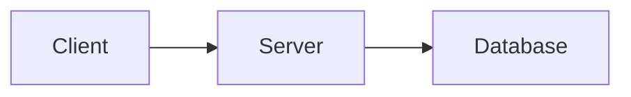
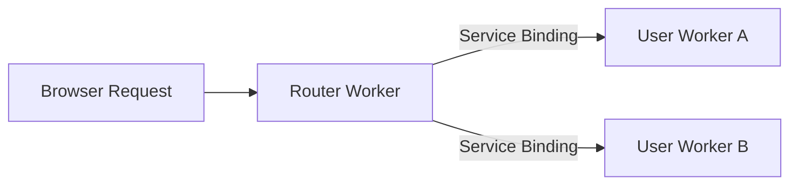

# Mermaid Diagram Rendering

Client-side rendering of Mermaid diagrams with ADQuest branding (orange `#f6821f`), light/dark theme support, and annotation footers.

## Usage

### Basic Diagram

````markdown

````

### With Title and Accessibility

````markdown

````

The `accTitle` appears in the annotation footer. Always include `accDescr` for screen readers.

## How It Works

1. Rehype plugin (`src/plugins/rehype/mermaid.ts`) transforms markdown code blocks to `<pre class="mermaid">`
2. Client script (`src/scripts/mermaid.ts`) renders diagrams as SVG with custom theme variables
3. Theme changes trigger automatic re-rendering via `MutationObserver`

## Customization

- **Theme variables**: Edit `mermaid.ts`
- **Container styles**: Edit `src/styles/mermaid.css`
- See [Mermaid theming docs](https://mermaid.js.org/config/theming.html)

## Troubleshooting

- **Not rendering**: Check browser console, validate syntax at [mermaid.live](https://mermaid.live/)
- **No annotation**: Ensure `accTitle` is included in diagram definition

## Related Files

- `src/scripts/mermaid.ts` - Rendering script
- `src/styles/mermaid.css` - Styles
- `src/plugins/rehype/mermaid.ts` - Markdown transformer
